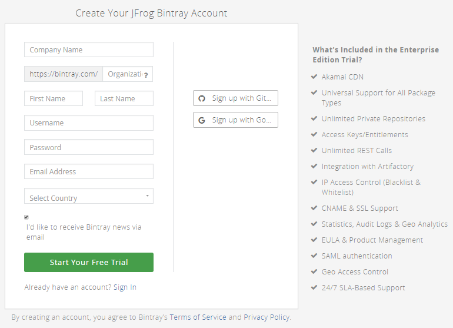
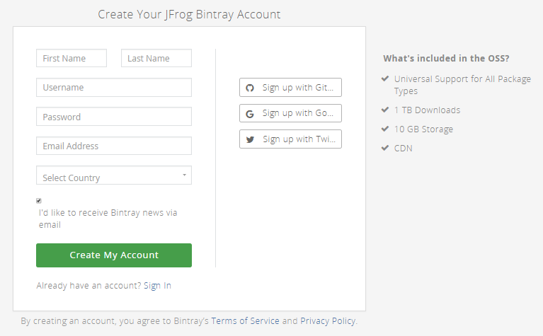
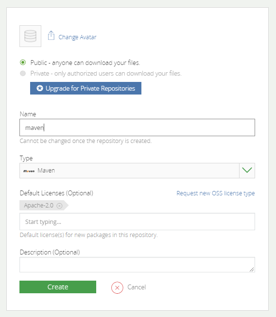
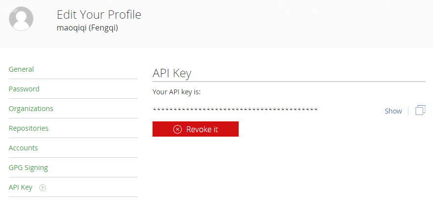
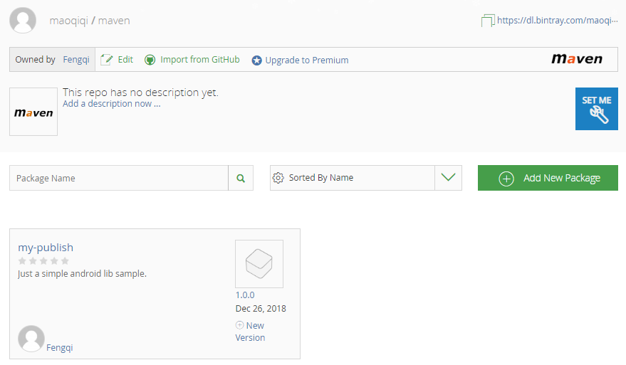
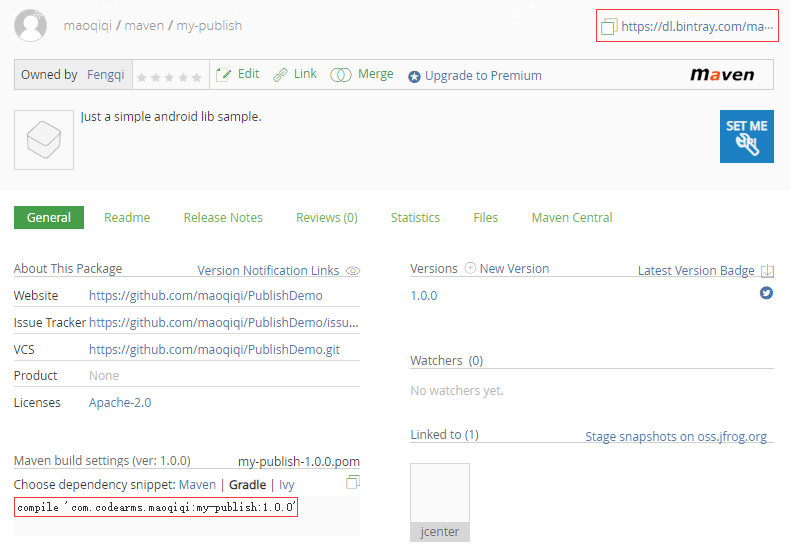
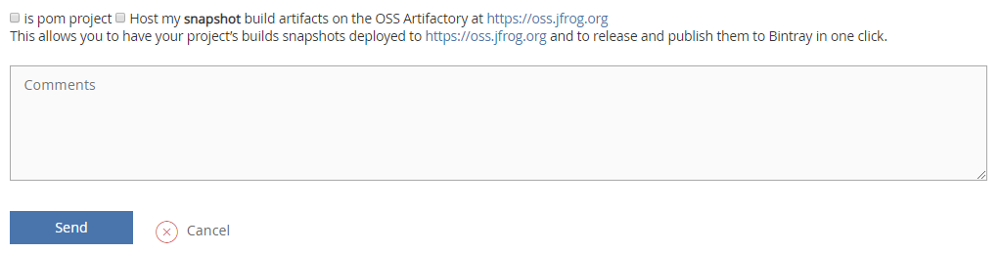
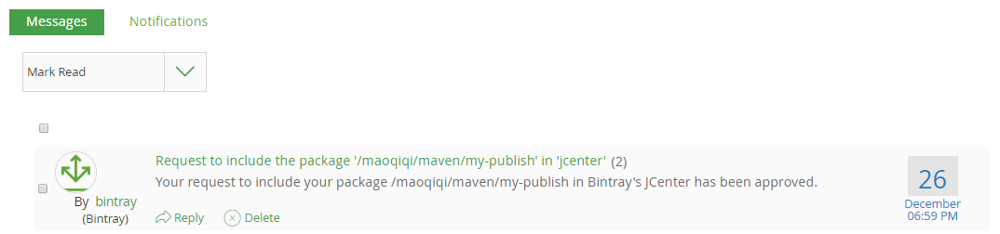
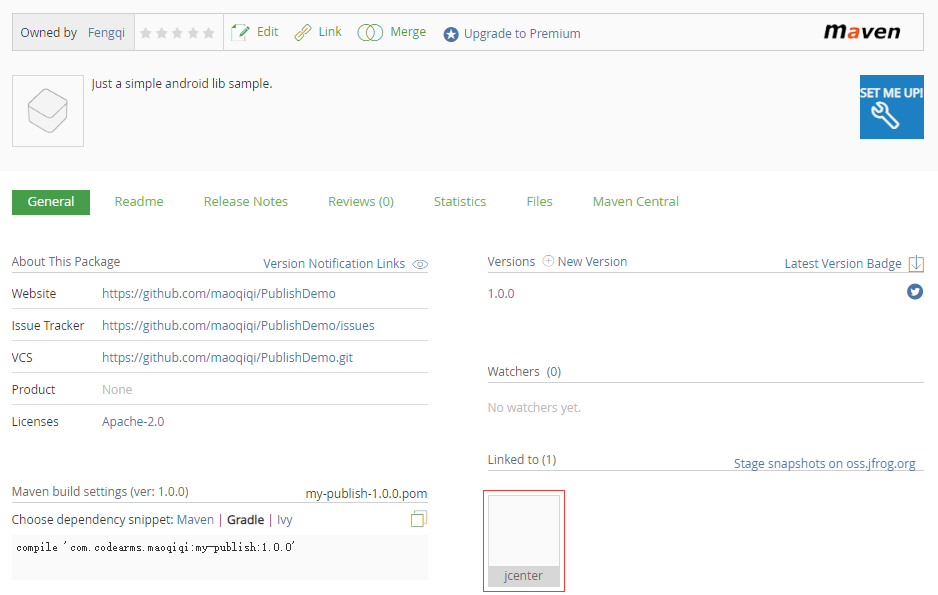

# Publish library to jcenter.

帮助Android开发人员将library发布到JCenter。项目中将需要的脚本封装好了，我们只需要配置相关属性即可一分钟上传Library到JCenter。（不包括审核时间）

[  ](https://bintray.com/maoqiqi/maven/my-publish/_latestVersion)
[  ](https://bintray.com/maoqiqi/custom-publish/custom-publish/_latestVersion)
[  ](https://bintray.com/maoqiqi/custom-publish/publish_1_1/_latestVersion)
[  ](https://bintray.com/maoqiqi/custom-publish/publish_1_2/_latestVersion)
[  ](https://bintray.com/maoqiqi/custom-publish/publish_1_3/_latestVersion)
[  ](https://bintray.com/maoqiqi/custom-publish/publish_2/_latestVersion)

## 目录

* [什么是Maven、JCenter、MavenCentral、JitPack、Bintray?](#h_1)
  * [Maven仓库](#Maven仓库)
  * [JCenter、MavenCentral、JitPack](#h_1_2)
  * [Bintray是什么?](#Bintray是什么)
* [准备工作](#准备工作)
  * [完成自己的Library](#完成自己的Library)
  * [Bintray网站上创建账户](#Bintray网站上创建账户)
  * [创建Maven仓库](#创建Maven仓库)
  * [保存APIKEY](#保存APIKEY)
* [上传Library到自己创建的Maven仓库](#上传Library到自己创建的Maven仓库)
  * [使用bintray-release插件](#使用bintray-release插件)
    * [配置bintray-release插件](#配置bintray-release插件)
    * [添加bintray-release插件需要的脚本](#添加bintray-release插件需要的脚本)
    * [执行bintray-release上传命令](#执行bintray-release上传命令)
  * [使用android-maven-gradle-plugin和gradle-bintray-plugin插件](#使用android-maven-gradle-plugin和gradle-bintray-plugin插件)
    * [配置插件](#配置插件)
    * [添加插件需要的脚本](#添加插件需要的脚本)
    * [执行插件上传命令](#执行插件上传命令)
* [提交到JCenter](#提交到JCenter)
* [一分钟上传Library到JCenter](#一分钟上传Library到JCenter)
  * [使用bintray-release插件脚本](#使用bintray-release插件脚本)
    * [配置bintray-release插件需要的公共参数](#配置bintray-release插件需要的公共参数)
    * [配置Bintray账号](#配置Bintray账号)
    * [配置bintray-release插件需要的项目信息](#配置bintray-release插件需要的项目信息)
    * [引入bintray_1脚本](#引入bintray_1脚本)
    * [通过bintray_1上传到Bintray](#通过bintray_1上传到Bintray)
  * [使用android-maven-gradle-plugin和gradle-bintray-plugin插件脚本](#使用android-maven-gradle-plugin和gradle-bintray-plugin插件脚本)
    * [配置插件需要的公共参数](#配置插件需要的公共参数)
    * [配置Bintray账号以及开发者信息](#配置Bintray账号以及开发者信息)
    * [配置插件需要的项目信息](#配置插件需要的项目信息)
    * [引入bintray_2脚本](#引入bintray_2脚本)
    * [通过bintray_2上传到Bintray](#通过bintray_2上传到Bintray)

<h2 id="h_1">什么是Maven、JCenter、MavenCentral、JitPack、Bintray?</h2>

相信很多人分不清这几个概念究竟代表什么，只知道跟着开源库的引入步骤走，比如要你在项目根目录下的build.gradle中加一个maven地址，然后在module的build.gradle中添加compile。

### Maven仓库

在用 Eclipse + Ant 组合的时候，我们往往引入一个库都是下载jar包或者aar包放到libs目录下，然后右键添加引用。
But！这并不友好，比如当升级版本库的时候往往需要下载新的包替换引用，非常麻烦。
所以，当升级到Android Studio + Gradle 组合后gradle中提供了可以从远端拉取jar包和aar包引入本地。规则就是：

`implementation 'com.codearms.maoqiqi:my-publish:2.0.0' // groupId:projectId:version`

但是这个下载源是哪呢，就是Maven仓库。那Maven仓库的地址是什么呢，是不是Android Studio都是从一个仓库获取包呢，这时候就需要了解 JCenter、MavenCentral、JitPack 了。

<h3 id="h_1_2">JCenter、MavenCentral、JitPack</h3>

这3个名词即具体的Maven仓库的地址，他们都是Maven仓库，但是属于不同的服务源。总的来说，只有两个标准的Android library文件服务器：Jcenter 和 MavenCentral，现在JitPack也流行了起来。（比较方便）

从哪引用这几个Maven仓库呢，就是在根目录build.gradle中：

```
allprojects {
    repositories {
        jcenter() // JCenter仓库
        mavenCentral() // MavenCentral仓库
        maven { url "https://jitpack.io" } // JitPack仓库
    }
}
```

具体使用哪个要看开源项目把Library传到了哪个仓库。它就会要求你在这加哪个仓库。
起初，Android Studio 选择MavenCentral作为默认仓库。如果你使用老版本的Android Studio创建一个新项目，mavenCentral()会自动的定义在build.gradle中。
但是MavenCentral的最大问题是对开发者不够友好。上传library异常困难。上传上去的开发者都是某种程度的极客。同时还因为诸如安全方面的其他原因，Android Studio团队决定把默认的仓库替换成jcenter。
正如你看到的，一旦使用最新版本的Android Studio创建一个项目，jcenter()自动被定义，而不是mavenCentral()。
我们发现第三个jitpack的写法和前2个不一样，写法是maven {} 里面加入地址，其实这个才是Maven仓库标准引用方法，jcenter和mavenCentral由于是标准的Android仓库，相当于定义了一个别名。

### Bintray是什么

Bintray其实只是一个网站，他们负责维护JCenter这个库，就是说JCenter库是托管在Bintray网站上的。但是Bintray不只只有JCenter库，每个人都可以在上面创建自己的账号，生成自己的Maven仓库。
比如我的账号maoqiqi下面创建了一个名叫"maven"的Maven仓库。那我的Maven仓库地址就是`https://bintray.com/maoqiqi/maven`。当然也可以再build中引入：

`maven { url 'https://dl.bintray.com/maoqiqi/maven' }`

而JCenter仓库只是Bintray官方账户创建的一个Maven仓库，地址是 https://jcenter.bintray.com 。
其实个人的仓库和JCenter是平级的，只不过JCenter被Android Gradle设为了标准仓库。


## 准备工作

上面把所有的概念都介绍清楚了。现在我们来介绍把自己的Library传到JCenter上需要做的准备工作。

### 完成自己的Library

发布的前提当然是自己的Library已经完成了。具体怎么写Library就不再赘述。

### Bintray网站上创建账户

注册组织： https://bintray.com/signup 。



注册个人： https://bintray.com/signup/oss 。



### 创建Maven仓库



仓库的Name可以写maven（上传的时候不指定的话默认仓库名是maven）。需要注意的是这里的Name要和我们后面上传配置中的artifactId一致，否则会上传失败。

### 保存APIKEY

在首页右上角点击Edit Profile进入个人信息编辑页面，接下来点击页面左边列表的最后一项API Key。

APIKEY的查看如下：




## 上传Library到自己创建的Maven仓库

### 使用bintray-release插件

#### 配置bintray-release插件

根目录build.gradle添加：

```
buildscript {
    repositories {
        google()
        jcenter()
    }
    dependencies {
        classpath 'com.android.tools.build:gradle:3.2.1'
        classpath 'com.novoda:bintray-release:0.9'
    }
}
```

#### 添加bintray-release插件需要的脚本

Module目录build.gradle添加：

```
apply plugin: 'com.novoda.bintray-release'

...

publish {
    // Contains the organisation name to use for upload.
    userOrg = 'maoqiqi'
    // [Default: maven] The repository name.
    repoName = 'maven'
    // The group id to use for the upload.
    groupId = 'com.codearms.maoqiqi'
    // The artifact id to use.
    artifactId = 'my-publish'
    // A string with the version to use. Can't end with -SNAPSHOT because bintray doesn't accept snapshots.
    publishVersion = '1.0.0'
    // A short description for this package in bintray.
    desc = 'Just a simple android lib sample.'
    // A string with the url for the website of this project. The Github repo can be used here.
    website = 'https://github.com/maoqiqi/PublishDemo'
}
```

> 提交JCenter的groupId和在本地定义的一样，所以本地定义groupId要能标识个人，最好到 https://jcenter.bintray.com 看下有没有重复的包名。

#### 执行bintray-release上传命令

打开Terminal执行上传的命令：

`./gradlew clean build bintrayUpload -PbintrayUser=BINTRAY_USERNAME -PbintrayKey=BINTRAY_KEY -PdryRun=false`

其中BINTRAY_USERNAME换成Bintray注册的用户名，BINTRAY_KEY换成自己的APIKEY。dryRun是一个配置参数，当为true的时候，会运行所有的环节，但是不会上传。

回车执行命令，看到BUILD SUCCESS即上传成功。这时候我们可以打开Maven仓库看到自己提交的项目。



### 使用android-maven-gradle-plugin和gradle-bintray-plugin插件

#### 配置插件

根目录build.gradle添加：

```
buildscript {
    repositories {
        google()
        jcenter()
    }
    dependencies {
        classpath 'com.android.tools.build:gradle:3.2.1'
        // Gradle Android Maven plugin
        classpath 'com.github.dcendents:android-maven-gradle-plugin:2.1'
        // Gradle Bintray Plugin
        classpath 'com.jfrog.bintray.gradle:gradle-bintray-plugin:1.8.4'
    }
}
```

#### 添加插件需要的脚本

Module目录build.gradle添加：

```
apply plugin: 'com.jfrog.bintray'
apply plugin: 'com.github.dcendents.android-maven'

...

// load properties
Properties properties = new Properties()
properties.load(rootProject.file('local.properties').newDataInputStream())

// read properties
def bintrayUser = properties.getProperty("bintray.user")
def bintrayKey = properties.getProperty("bintray.key")

// set the maven groupId and version
group = 'com.codearms.maoqiqi'
version = '1.0.0'

// This generates POM.xml with proper parameters
install {
    repositories.mavenInstaller {
        pom {
            project {
                packaging 'aar'
                name 'my-publish'
                description 'Just a simple android lib sample.'
                url 'https://github.com/maoqiqi/PublishDemo'
                licenses {
                    license {
                        name 'The Apache Software License, Version 2.0'
                        url 'http://www.apache.org/licenses/LICENSE-2.0.txt'
                    }
                }
                developers {
                    developer {
                        id 'maoqiqi'
                        name 'Fengqi Mao'
                        email 'fengqi.mao.march@gmail.com'
                    }
                }
                scm {
                    connection 'https://github.com/maoqiqi/PublishDemo.git'
                    developerConnection 'https://github.com/maoqiqi/PublishDemo.git'
                    url 'https://github.com/maoqiqi/PublishDemo'
                }
            }
        }
    }
}

// bintray configuration
bintray {
    user = bintrayUser
    key = bintrayKey

    // [Default: false] Whether to run this as dry-run, without deploying
    dryRun = false
    // [Default: false] Whether version should be auto published after an upload
    publish = true
    // [Default: false] Whether to override version artifacts already published
    override = false

    // Package configuration. The plugin will use the repo and name properties to check if the package already exists.
    // In that case, there's no need to configure the other package properties (like userOrg, desc, etc).
    pkg {
        // Mandatory parameters:
        repo = 'maven'
        name = 'my-publish'
        licenses = ['Apache-2.0']
        vcsUrl = 'https://github.com/maoqiqi/PublishDemo.git'

        // Optional parameters:
        // An optional organization name when the repo belongs to one of the user's orgs
        userOrg = 'maoqiqi'
        desc = 'Just a simple android lib sample.'
        websiteUrl = 'https://github.com/maoqiqi/PublishDemo'
        issueTrackerUrl = 'https://github.com/maoqiqi/PublishDemo/issues'
        // labels = ['android', 'library', 'jcenter', 'bintray', 'publish']
        // publicDownloadNumbers = true
        // Optional package-level attributes
        // attributes = ['a': ['ay1', 'ay2'], 'b': ['bee'], c: 'cee']
        // Optional Github repository
        // githubRepo = 'maoqiqi/PublishDemo'
        // Optional Github readme file
        // githubReleaseNotesFile = 'README.md'

        // Optional version descriptor
        version {
            // Mandatory parameters:
            // Mandatory bintray logical version name
            name = '1.0.0'

            // Optional parameters:
            // Optional Version-specific description
            desc = 'Just a simple android lib sample.'
            // Optional Date of the version release. 2 possible values: date in the format of 'yyyy-MM-dd'T'HH:mm:ss.SSSZZ' OR a java.util.Date instance
            released = new Date()
            // Optional version-level attributes
            attributes = ['gradle-plugin': 'com.use.less:com.use.less.gradle:gradle-useless-plugin']
            vcsTag = 'v1.0.0'

            // Optional configuration for GPG signing
            /*gpg {
                // Determines whether to GPG sign the files. The default is false
                sign = true
                // Optional The passphrase for GPG signing'
                passphrase = 'passphrase'
            }*/
            // Optional configuration for Maven Central sync of the version
            /*mavenCentralSync {
                // [Default: true] Determines whether to sync the version to Maven Central.
                sync = true
                // OSS user token: mandatory
                user = 'userToken'
                // OSS user password: mandatory
                password = 'password'
                // Optional property. By default the staging repository is closed and artifacts are released to Maven Central.
                // You can optionally turn this behaviour off (by puting 0 as value) and release the version manually.
                close = '1'
            }*/
        }
    }
    configurations = ['archives']
}

// The following is the task of generating sources.jar and javadoc.jar

// This generates sources.jar
task sourcesJar(type: Jar) {
    // Specify the source code through the from function, which is the default source
    from android.sourceSets.main.java.srcDirs
    classifier = 'sources'
}

// Set the Javadoc
task javadoc(type: Javadoc) {
    source = android.sourceSets.main.java.srcDirs
    classpath += project.files(android.getBootClasspath().join(File.pathSeparator))
}

// This generates javadoc.jar, dependsOn here means that this task will only start after the javadoc complete.
task javadocJar(type: Jar, dependsOn: javadoc) {
    from javadoc.destinationDir
    classifier = 'javadoc'
}

artifacts {
    archives sourcesJar
    archives javadocJar
}
```

#### 执行插件上传命令

打开Terminal执行上传的命令：

`./gradlew bintrayUpload`

回车执行命令，看到BUILD SUCCESS即上传成功。

## 提交到JCenter

在我们上传到自己Maven仓库后其实就已经可以引用自己的库了。只要在根目录下的build.gradle加上自己maven地址。

`maven { url 'https://dl.bintray.com/maoqiqi/maven' }`

然后在app的build.gradle中加上引用即可。

`implementation 'com.codearms.maoqiqi:my-publish:2.0.0'`



点Sync，可以发现引用成功。

如果能够提交到JCenter就更好了，不再需要定义自己Maven仓库地址，直接compile即可。进入项目页，点击 Add to JCenter 。



然后直接Send就行，最后等待Bintray审核通过。通过后右上方小邮箱按钮会有提示信息，提示审核通过。

> JCenter是不提供snapshot版本发布的，如果需要托管snapshot版本，需要在申请时勾上" Host my snapshot build artifacts on the OSS Artifactory at https://oss.jfrog.org "的选项，
这允许您将需要托管的snapshot版本部署到 https://oss.jfrog.org ，并将它们发布到Bintray。



回到项目页信息多了个JCenter图标。



这时候Library就已经成功提交到了JCenter，我们回到项目中将根目录build.gradle中的个人Maven仓库引用删掉，只保留JCenter，Sync。大功告成！！！


## 一分钟上传Library到JCenter

该示例已经将需要写的脚本封装好了，我们只需要配置相关属性即可，一分钟上传Library到JCenter。（不包括审核时间哦）

### 使用bintray-release插件脚本

首先[配置bintray-release插件](#配置bintray-release插件)。

#### 配置bintray-release插件需要的公共参数

继续在根目录build.gradle添加公共参数：

```
ext {
    bintray = [
            userOrg : "maoqiqi",
            repoName: 'my-publish',
            groupId : 'com.codearms.maoqiqi',
            website : 'https://github.com/maoqiqi/PublishDemo'
    ]
}
```

* userOrg：Bintray 的用户名或者组织名
* repoName：Bintray 上建的仓库名
* groupId：项目组Id，通常情况下如果你的包名为 com.example.test ，那么项目组Id就是 com.example 。
* website：项目官方网站的地址，没有的话就用 Github 上的地址，例如：https://github.com/maoqiqi/PublishDemo 。

#### 配置Bintray账号

在local.properties加上以下配置信息：

```
#bintray
bintray.user=
bintray.apikey=
```

* bintray.user：Bintray 的用户名
* bintray.apikey：Bintray 的 API Key

> **注意**：要将local.properties文件加入忽略列表，以免被提交到Github或其他网站泄露个人信息。

#### 配置bintray-release插件需要的项目信息

在Module目录下gradle.properties（没有新建该文件）配置项目信息：

```
#project
projectName=my-publish
projectDescription=Just a simple android lib sample.
```
* projectName：项目名称，通常情况下如果你的包名为 com.example.test ，那么项目名称就是 test 。
* projectDescription：项目描述

#### 引入bintray_1脚本

下载 bintray_1.gradle 文件并放到你的项目根目录下。

然后修改你Module目录下的 build.gradle 文件，在最后加上 `apply from: '../bintray_1.gradle'` 。

#### 通过bintray_1上传到Bintray

打开Terminal执行上传的命令：`gradlew bintrayUpload` 命令即可。看到BUILD SUCCESS即上传成功。

前面所有步骤走完之后实际上只是上传了你的项目到Bintray而已，并没有被包含在JCenter中，要想提交到JCenter中还需要Bintray的审核。请参考[提交到JCenter](#提交到JCenter)。

### 使用android-maven-gradle-plugin和gradle-bintray-plugin插件脚本

首先[配置插件](#配置插件)。

#### 配置插件需要的公共参数

跟[配置bintray-release插件需要的公共参数](#配置bintray-release插件需要的公共参数)信息一致。

#### 配置Bintray账号以及开发者信息

在local.properties加上以下配置信息：

```
#bintray
bintray.user=
bintray.apikey=

#developer
developer.id=
developer.name=
developer.email=
```

```
* bintray.user：Bintray 的用户名
* bintray.apikey：Bintray 的 API Key
* developer.id：通常是你在开源社区的昵称
* developer.name：姓名
* developer.email：邮箱
```

> **注意**：要将local.properties文件加入忽略列表，以免被提交到Github或其他网站泄露个人信息。

#### 配置插件需要的项目信息

跟[配置bintray-release插件需要的项目信息](#配置bintray-release插件需要的项目信息)一致。

#### 引入bintray_2脚本

下载 bintray_1.gradle 文件并放到你的项目根目录下。

然后修改你的Module目录下的 build.gradle 文件，在最后加上 `apply from: '../bintray_2.gradle'` 。

#### 通过bintray_2上传到Bintray

打开Terminal执行上传的命令：gradlew bintrayUpload 命令即可。看到BUILD SUCCESS即上传成功。

前面所有步骤走完之后实际上只是上传了你的项目到Bintray而已，并没有被包含在JCenter中，要想提交到JCenter中还需要Bintray的审核。请参考[提交到JCenter](#提交到JCenter)。